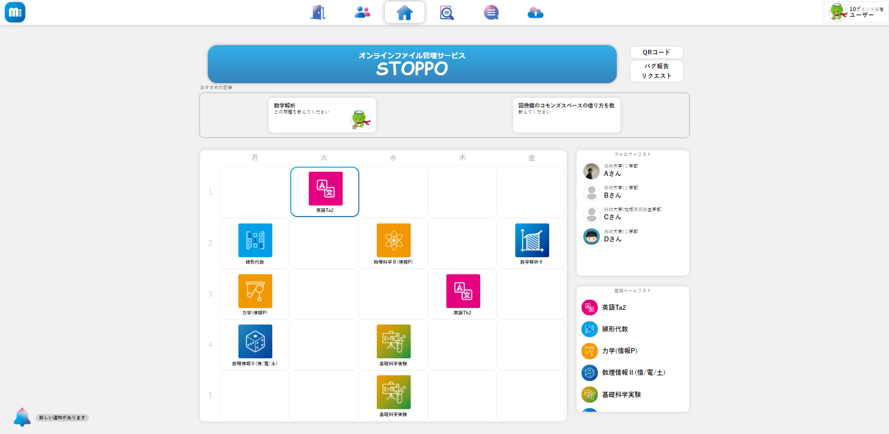
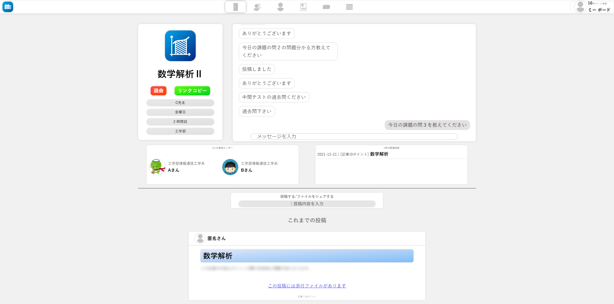
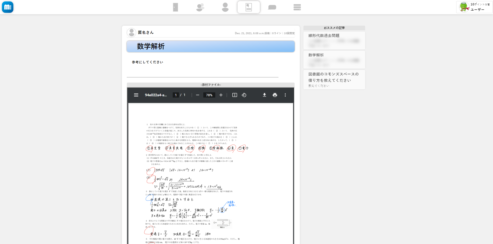
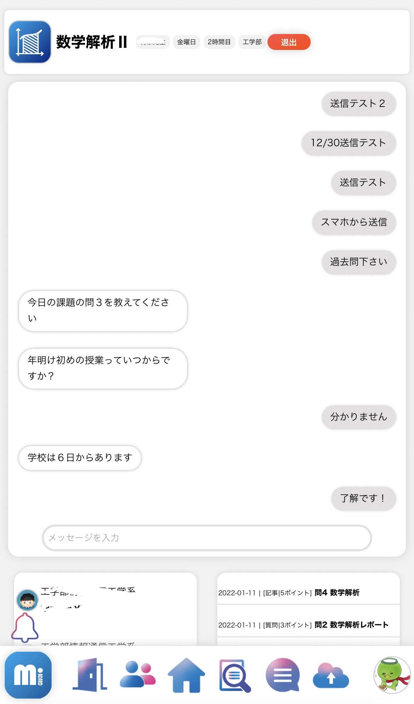
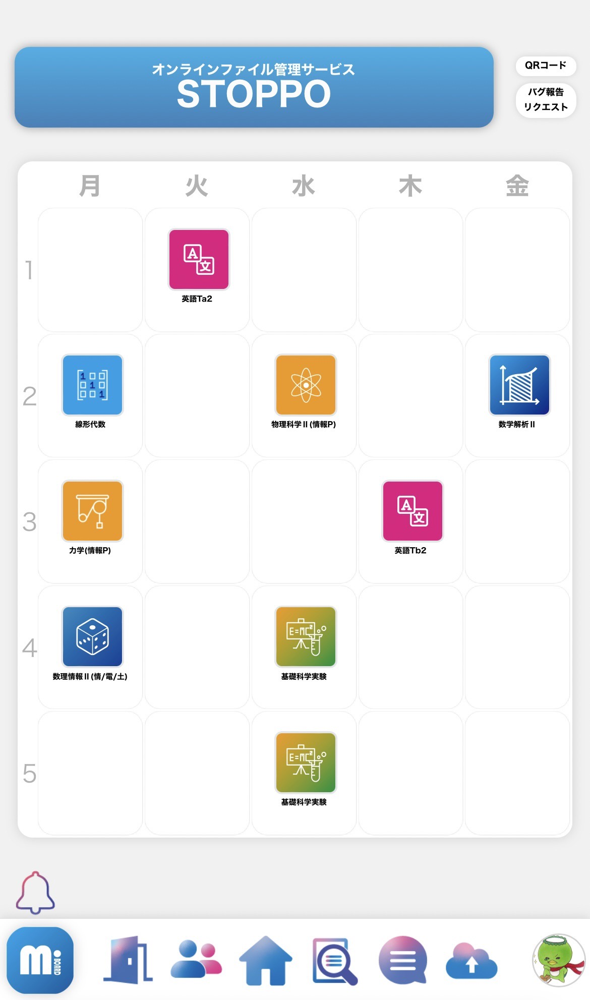
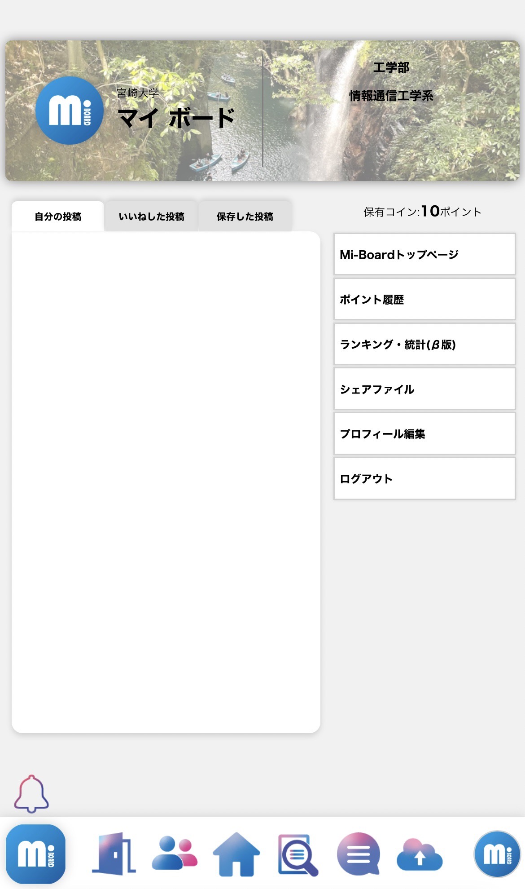
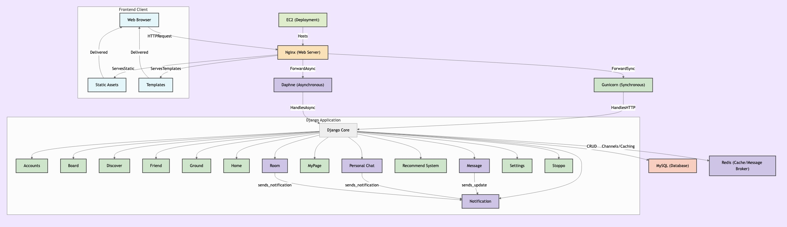

  
  
  
  
  
  
  

 
 

<h1><a href="https://mi-board.com">Mi-Board</a></h1>

  Mi-Board（マイ・ボード）は、コロナ禍で減少した学生間のオフラインでの情報交換の機会を補うために開発された、大学生限定のSNS＋知恵袋型サービスです（※公開はされていません）。大学メールと学籍番号による認証で使える信頼性の高い環境を提供します。

  

<h2>サービスの特徴</h2>
<ul>
  <li>
    <strong>時間割登録＆講義ルーム：</strong>
    自分の時間割を登録すると、同じ授業を受けている友人と授業内容や情報を交換できます。
  </li>
  <li>
    <strong>知恵袋：</strong>
    課題やレポートについての質問や意見交換もできるので、勉強のヒントやアドバイスが得られます。
  </li>
  <li>
    <strong>SNS機能：</strong>
    友達フォロー、プロフィール閲覧、チャット、オンラインストレージなど、大学生活をサポートする各種機能を搭載しています。
  </li>
</ul>

  

<h2>主な機能</h2>
<ul>
  <li><strong>Friend :</strong> 友達のフォローや検索、プロフィール閲覧</li>
  <li><strong>Home :</strong> 自分の時間割や重要情報の確認</li>
  <li><strong>Board :</strong> 質問や回答を通した知識・情報のシェア</li>
  <li><strong>Room :</strong> 授業ごとの情報交換ルーム</li>
  <li><strong>Chat :</strong> 直接メッセージのやり取り</li>
  <li><strong>Stoppo :</strong> オンラインストレージでファイル管理</li>
</ul>

  

  

 

<table width="100%" style="border-collapse: collapse; border: none;">
  <tr>
    <td width="50%" align="center">
      
    </td>
    <td width="50%" align="center">
      
    </td>
  </tr>
</table>

 

<table width="100%" style="border-collapse: collapse; border: none;">
  <tr>
    <td width="33%" align="center">
      
    </td>
    <td width="33%" align="center">
      
    </td>
    <td width="33%" align="center">
      
    </td>
  </tr>
</table>

 
 

<h2>アーキテクチャ図</h2>

powered by <a href="https://gitdiagram.com/">GitDiagram</a>

 

<h2>採用技術</h2>

<ul>
  <li><strong>言語 :</strong> Python</li>
  <li><strong>フレームワーク :</strong> Django</li>
  <li><strong>フロントエンド :</strong> HTML, CSS, JavaScript (jQuery)</li>
  <li><strong>データベース :</strong> MySQL, Redis</li>
  <li><strong>インフラ :</strong> Amazon EC2</li>
  <li><strong>サーバサイド :</strong> Nginx, Daphne, gunicorn</li>
</ul>

